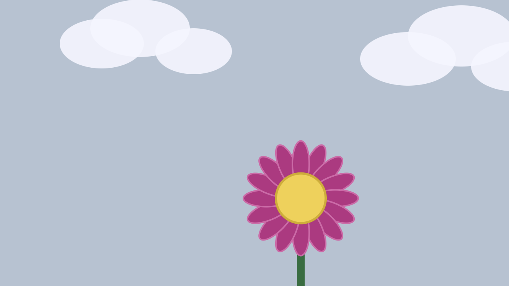

# Clase 10

## Plantilla examen

### Título del proyecto

I'll Take Care of You

### Referencia de origen / bibliografía

Nos basamos en la canción “I’ll Take Care of You”, porque su mensaje central es el compromiso de estar ahí y proteger a quien amas, 
sin importar las dificultades. Esta idea es exactamente lo que representamos en nuestro juego: asumimos el papel de cuidadores y 
acompañamos a la flor en su camino, ayudándola a subir, limpiando el cielo de nubes y superando cada reto para que pueda recibir la luz
que necesita para vivir y florecer. Al final, toda nuestra acción se resume en cumplir esa promesa: cuidar, proteger y dar lo necesario 
para que otro pueda crecer.

### Imagen de referencia de proyecto

Deja acá una imagen de la "portada" de tu proyecto. Como si fuera un afiche. Puede ser un fotograma de toda la interacción.

### Integrantes

Estudiante A [maaartiii)

Estudiante B [pansitoaceituna)

### Enlace de p5.js 

(https://editor.p5js.org/martiiii/sketches/SybgwVB7u)

### Relato inicial

Cuenta acá el relato de origen de tu proyecto. Ej, Alicia está con un conejo, luego va a un viaje psicodélico

### Storyboard

Imágenes del storyboard, las que deben verse acá y estar subidas en el mismo repositorio

###Estado 0: Pantalla inicial negra

 Explicación

Es la primera pantalla que se ve al abrir el juego. Tiene un fondo negro y solo muestra un mensaje para indicar que el usuario debe hacer clic para empezar. Mientras tanto, el programa carga en segundo plano la música y los recursos necesarios. Sirve como punto de partida y de espera.
 Código

javascript

Run

function estadoInicial() {
  background(0);
  fill(255);
  textSize(30);
  text("HAZ CLIC PARA COMENZAR", width/2, height/2);
  textSize(18);
  text(cargado ? "Listo para empezar" : "Cargando...", width/2, height/2 + 50);
}

#### Estado 1: Día nublado - Inicio de la historia

 Explicación

Aparece un cielo de color grisáceo cubierto de nubes. En la parte inferior se dibuja el tallo y la flor pequeña, que aún no ha podido crecer. Se muestra el texto que cuenta la situación: la flor necesita luz para vivir, pero el cielo está completamente tapado. Aquí se presenta el reto principal: debemos ayudarla.
 Código

javascript

Run

function estadoDiaNublado() {
  background(180, 195, 210);
  dibujarNubes();
  dibujarTalloYFlorEstatica(width/2, height - 100);

  fill(40);
  textSize(26);
  text("Un día gris y muy nublado...", width/2, 60);
  textSize(20);
  text("La flor necesita luz para vivir", width/2, 110);
  text("pero el cielo está totalmente cubierto.", width/2, 150);
  textSize(16);
  text("Haz clic para continuar", width/2, height - 40);
}
###Estado 2: Explicación del reto

 Explicación

Se mantiene el mismo fondo nublado, pero ahora se detallan claramente las instrucciones. Le dice al usuario qué debe hacer en cada etapa: subir la flor, quitar las nubes y luego ayudar a Pou. Es la guía para que se entienda cómo jugar y qué se espera en cada momento.
 Código

javascript

Run

function estadoExplicacionReto() {
  background(180, 195, 210);
  dibujarNubes();
  dibujarTalloYFlorEstatica(width/2, height - 100);

  fill(30);
  textSize(24);
  text("¿Quieres salvar la flor?", width/2, 60);
  textSize(19);
  text("1. Desliza HACIA ABAJO para subirla", width/2, 120);
  text("2. Al llegar arriba, limpia las nubes usando el scroll", width/2, 160);
  text("3. ¡Ayuda a Pou a subir por el tallo!", width/2, 200);
  textSize(16);
  text("Haz clic para empezar", width/2, height - 40);
}
### Estado 3: Subiendo con scroll

 Explicación

Aquí comienza la acción principal. Al mover la rueda del ratón hacia abajo, la flor va subiendo poco a poco por el tallo. La velocidad es controlada para que sea un proceso progresivo y requiera esfuerzo. En pantalla se ve el porcentaje de avance. Representa el acompañamiento y el cuidado: hacemos el camino junto a ella.
 Código

javascript

Run

function estadoSubiendo() {
  background(180, 195, 210);
  dibujarNubes();

  alturaFlor += velocidadSubida;
  alturaFlor = constrain(alturaFlor, 0, 320);
  florYIntro = height - 100 - alturaFlor;

  stroke(34, 110, 60);
  strokeWeight(10);
  line(width/2, height, width/2, florYIntro);
  dibujarFlorVectorial(width/2, florYIntro);

  fill(30);
  textSize(22);
  text("DESLIZA HACIA ABAJO PARA SUBIR", width/2, 40);
  textSize(18);
  text("Progreso: " + Math.round((alturaFlor / 320) * 100) + "%", width/2, height - 40);

  if (alturaFlor >= 315) {
    estado = 4;
  }
}
###Estado 4: Quitar nubes con scroll

 Explicación

Cuando la flor llega a la parte más alta, las nubes no desaparecen solas. Ahora hay que usar la rueda del ratón: hacia abajo para quitar las de la izquierda y hacia arriba para las de la derecha. Se muestra cuántas faltan. Esta etapa significa eliminar obstáculos para que llegue la luz, tal como se cuida a alguien quitando lo que le impide avanzar.
 Código

javascript

Run

function estadoQuitarNubes() {
  background(180, 195, 210);
  dibujarNubes();

  stroke(34, 110, 60);
  strokeWeight(10);
  line(width/2, height, width/2, 80);
  dibujarFlorVectorial(width/2, 80);

  fill(30);
  textSize(24);
  text("¡Llegaste arriba!", width/2, 40);
  textSize(16);
  fill(50);
  text("Scroll hacia ABAJO quita las de la IZQUIERDA", width/2, height - 90);
  text("Scroll hacia ARRIBA quita las de la DERECHA", width/2, height - 60);
  textSize(20);
  fill(30);
  text("Nubes quitadas: " + nubesQuitadas + " / " + totalNubes, width/2, height - 25);

  if (nubesQuitadas >= totalNubes) {
    prepararJuegoPou();
    estado = 5;
  }
}
###Estado 5: Pantalla inicio Pou

Explicación

Una vez despejado el cielo, este cambia a un color azul claro. Se dibuja el tallo completo en el centro. Se muestra el título del juego y se explica que el objetivo es llegar a 100 puntos para que la flor florezca. Es la transición hacia el último reto.
 Código

javascript

Run

function pantallaInicioPou() {
  background(135, 206, 235);
  dibujarTalloFijo();

  fill(0);
  textAlign(CENTER, CENTER);
  textSize(35);
  text("POU SKY JUMP", width / 2, 180);
  textSize(20);
  text("Llega a 100 puntos para hacer florecer la cima", width / 2, 240);
  textSize(18);
  text("Haz click para empezar a saltar", width / 2, 290);
}
###Estado 6: Jugando Pou

Explicación

Aquí comienza el reto final: el personaje Pou cae por gravedad, y el usuario lo mueve con el ratón. Cada vez que toca una plataforma, salta y sube. A medida que avanza, se suman puntos. Al llegar a 100 puntos, se gana. Representa el esfuerzo final para garantizar que todo salga bien y cumplir nuestra promesa de cuidado.
 Código

javascript

Run

function jugandoPou() {
  background(135, 206, 235);
  dibujarTalloFijo();

  fill(0);
  textAlign(LEFT, TOP);
  textSize(20);
  text("Puntos: " + puntos + " / 100", 20, 20);

  if (puntos >= 100) {
    florYIntro = -150;
    estado = 8;
  }

  pou.x = mouseX;
  pou.vy += gravedad;
  pou.y += pou.vy;

  push();
  fill(150, 90, 40);
  noStroke();
  ellipse(pou.x, pou.y, pou.r * 2);
  fill(255);
  ellipse(pou.x - 6, pou.y - 5, 6);
  ellipse(pou.x + 6, pou.y - 5, 6);
  fill(0);
  ellipse(pou.x - 6, pou.y - 5, 2);
  ellipse(pou.x + 6, pou.y - 5, 2);
  pop();

  fill(100);
  stroke(50);
  strokeWeight(2);
  for (let p of plataformas) {
    p.y += velocidadEscenario;
    rect(p.x, p.y, p.w, p.h, 5);

    if (pou.vy > 0 && pou.x > p.x && pou.x < p.x + p.w && pou.y + pou.r > p.y && pou.y + pou.r < p.y + p.h + 10) {
      pou.vy = salto;
    }

    if (p.y > height) {
      p.y = 0;
      p.x = random(100, width - 180);
      puntos++;
    }
  }

  if (pou.y > height) {
    tiempoGameOver = frameCount;
    estado = 7;
  }
}
###Estado 7: Game Over Pou

 Explicación

Si Pou cae al vacío sin tocar ninguna plataforma, aparece esta pantalla. El fondo se pone negro y se muestra el mensaje “GAME OVER”. Se invita a hacer clic para volver a intentarlo. Refleja que, si fallamos, siempre podemos volver a empezar para seguir cuidando a la flor.
 Código

javascript

Run

function gameOverPou() {
  background(0);
  fill(255);
  textAlign(CENTER, CENTER);
  textSize(40);
  text("GAME OVER", width / 2, height / 2 - 20);
  textSize(20);
  text("Haz click para reintentar el nivel", width / 2, height / 2 + 40);
}
###Estado 8: Pantalla de Victoria

 Explicación

Al llegar a los 100 puntos, se alcanza el final. El cielo se aclara por completo, sale el sol brillando y la flor baja hasta el centro, creciendo, girando y rodeada de destellos. Aparece el mensaje de victoria. Es el resultado de todo el camino: cumplimos nuestra promesa de cuidar, acompañar y superar dificultades, tal como lo expresa la canción “I’ll Take Care of You”.
 Código

javascript

Run

function pantallaVictoria() {
  if (brilloCielo < 1) brilloCielo += 0.02;
  background(lerp(135, 110, brilloCielo), lerp(206, 180, brilloCielo), lerp(235, 255, brilloCielo));
 
  dibujarSol(140);
  dibujarTalloFijo();

  if (florYIntro < height / 2) {
    florYIntro += 4;
  }

  push();
  translate(width / 2, florYIntro);
  noStroke();
  for (let i = 0; i < 8; i++) {
    rotate(TWO_PI / 8 + frameCount * 0.01);
    fill(255, 255, 150, 80 + sin(frameCount * 0.1) * 40);
    triangle(-20, 0, 20, 0, 0, -250);
  }
  pop();

  push();
  translate(width / 2, florYIntro);
  rotate(anguloRotacionWin);
  anguloRotacionWin += 0.04;
  dibujarFlorVectorial(0, 0);
  pop();

  fill(255, 220, 0);
  stroke(186, 45, 131);
  strokeWeight(5);
  textAlign(CENTER, CENTER);
  let escalaTexto = 65 + sin(frameCount * 0.1) * 8;
  textSize(escalaTexto);
  text("WIIN", width / 2, 80);

  noStroke();
  fill(20, 60, 20);
  textSize(18);
  text("Click para jugar de nuevo", width / 2, height - 70);
  fill(80);
  text("Presiona R para resetear historia", width / 2, height - 40);
}
